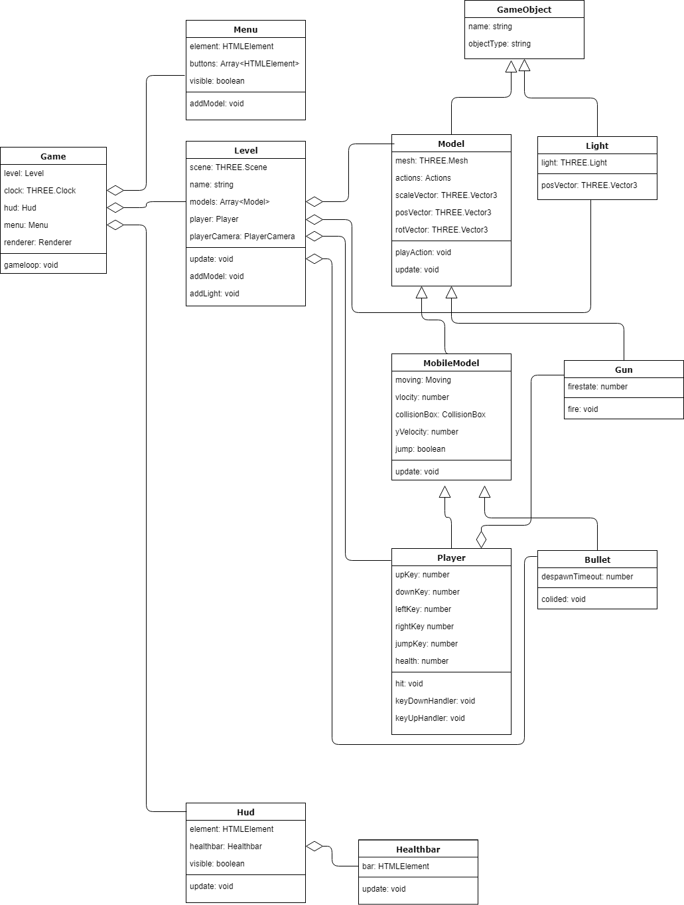

# programmeren-game
[>> Link naar game. <<](https://pedro-bronsveld.github.io/programmeren-game/)

## UML diagram

## feedback game Lem
[Repository](https://github.com/boltgolt/prg4-game)

De OOP principes zijn allemaal toegepast in de game. 
De game is verdeeld in classes, waarvan een aantal eigenschappen van elkaar eigenschappen overerfen. 
Eigenschappen die alleen door de class zelf moeten kunnen worden aangepast staan aangegeven met 'private'.

De game zelf heeft helaas nog geen echt doel, en mist een startscherm en eindscherm.
Daarentegen zijn er geen bugs, en voelen de controls erg soepel aan.